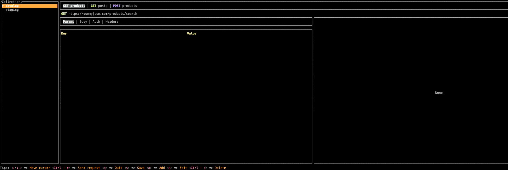

# ResTui - TUI Rest API Client

a CLI tool that can send HTTP requests with TUI.



## Features

- Multiple collections can be created to manage requests.
- Environment variables can be set in .env files.
- Intuitive keyboard only control

## Installation

```bash
$ brew install harehare/tap/restui
```

## Build

```bash
$ sbt "graalvm-native-image:packageBin"
```

```bash
$ sbt assembly
```

## Usage

```bash
$ restui
```

```bash
ResTui v0.1.0 -- ResTui is http request management tool

USAGE

  $ restui [(-c, --config file)] [(-e, --env file)]

OPTIONS

  (-c, --config file)
    An existing file.

    This setting is optional. Default: '~/.config/restui/collections.json'.

  (-e, --env file)
    An existing file.

    This setting is optional. Default: 'None'.
```

### Environment

Environment variables defined in the .env file can be used to replace request URLs, query parameters, headers, and body values in the form `${ENV}`.
.env files are specified with the `--env` or `-e` option.


## Keymap

| Key                                                    | Description           |
| ------------------------------------------------------ | --------------------- |
| <kbd>←</kbd>, <kbd>↓</kbd>, <kbd>↑</kbd>, <kbd>→</kbd> | Move                  |
| <kbd>Ctrl</kbd> + <kbd>r</kbd>                         | Send                  |
| <kbd>a</kbd>                                           | Add                   |
| <kbd>c</kbd>                                           | Copy                  |
| <kbd>e</kbd>                                           | Edit                  |
| <kbd>m</kbd>                                           | Change (Method, Body) |
| <kbd>Ctrl</kbd> + <kbd>d</kbd>                         | Delete                |
| <kbd>d</kbd>                                           | Duplicate             |
| <kbd>s</kbd>                                           | Save                  |
| <kbd>Ctrl</kbd> + <kbd>r</kbd>, <kbd>q</kbd>           | Quit                  |

## Configuration

You can change the command to use with environment variables.

```bash
RESTUI_PBCOPY=pbcopy
RESTUI_EDITOR=vim
```

## License

MIT
